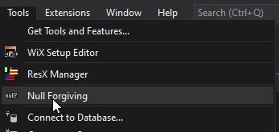
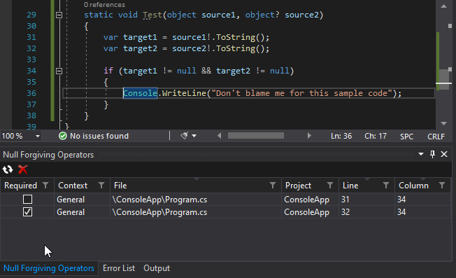
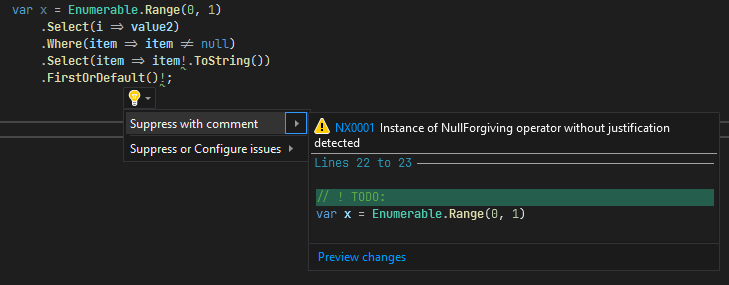
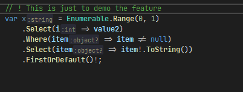

# Nullable Extended
[](https://dev.azure.com/tom-englert/Open%20Source/_build/latest?definitionId=39&branchName=master)
[](https://www.nuget.org/packages/Nullable.Extended.Analyzer/)

## Roslyn Tools and Analyzers to improve the experience when coding with Nullable Reference Types.

[Nullable reference types](https://docs.microsoft.com/en-us/dotnet/csharp/nullable-references) 
are a great feature introduced with C# 8.0. It really helps in writing better code.

This project helps to improve the experience when coding with nullable reference types.

### Managing Null-Forgiving Operators

Sometimes it is necessary to use the
[null-forgiving operator "!"](https://docs.microsoft.com/en-us/dotnet/csharp/language-reference/operators/null-forgiving)
to suppress a false warning.
However using too many of them will render the value of nullable checks almost useless. 

It's hard to find the null forgiving operators in code, because the `!` symbol is so unobtrusive, and has multiple meanings in code.

Another obstacle is that after some time you or your colleagues won't remember why you have
added a null-forgiving operator, or if its usage has been validated, so you will have to look at the code again and again.

This toolset will assist you in managing these problems. 
It will detect and show occurrences of the null-forgiving operator and encourage you to annotate them with a justification comment,
so you and your colleagues will instantly know why this usage of the null-forgiving operator is required.

The [Visual Studio Extension](#visual-studio-extension) will show you all occurrences in a list, 
while the [analyzer](#roslyn-analyzer) will generate a warning for every occurrence that is not annotated with a justification comment,
and provides a code fix to add the scaffold for the justification comment.

Justification comments are one or more single line comments above the statement or declaration that start with `\\ ! `, followed by some justification text:
```c#
// ! This is only needed to demo the feature
var text = value1!.ToString();
```
#### There are two tools available:
- A [Visual Studio Extension](#visual-studio-extension) that analyzes your sources and tracks usage of null forgiving operators.
- A [Roslyn Analyzer](#roslyn-analyzer) that shows a warning for every unjustified usage of the null-forgiving operator, and also double-checks nullability warnings and suppresses some false positives.

## Visual Studio Extension

The [Visual Studio Extension](#visual-studio-extension) lists all occurrences, 
categorizes them, and even detects those that are still present in code but no longer needed.

Occurrences are grouped into three categories, to reflect their different contexts:
- General usages of the null-forgiving operator.
- Null-forgiving operator on the `null` or `default` literals.
- Null-forgiving operator inside lambda expressions.

> e.g. general usages can be mostly avoided by cleaning up the code,
while inside lambda expressions they are often unavoidable

### Installation

Install the extension from the [Visual Studio Marketplace](https://marketplace.visualstudio.com/items?itemName=TomEnglert.NullableExtended) or from the [Releases](../../releases) page.
The latest CI build is available from the [Open VSIX Gallery](https://www.vsixgallery.com/extension/Nullable.Extended.75a92614-c590-4401-b04b-04926c0e21cf)

### Usage

Start the tool window from the tools menu:



In the tool window you can see all occurrences of the null-forgiving operator in your solution and their justification comments.
It also shows if the null-forgiving operator is required to suppress nullable warnings. 
If the "Required" column is not checked, it is a hint that the null-forgiving operator might be obsolete and can probably be removed.



- Click the refresh button to scan your solution.
- Double click any entry to navigate to the corresponding source code.

---
## Roslyn Analyzer

### Installation

Simply install the [NuGet Package](https://www.nuget.org/packages/Nullable.Extended.Analyzer/) in your projects.

### Show unjustified occurrences of the null-forgiving operator as warnings

The analyzer will generate a warning for every unjustified occurrence of the null-forgiving operator. Depending on the context the code will be NX0001 to NX0003.

A warning will be shown for unjustified occurrences:



The warning will disappear after a justification comment has been added:



> You can easily configure the warning levels via you editor.config file.

