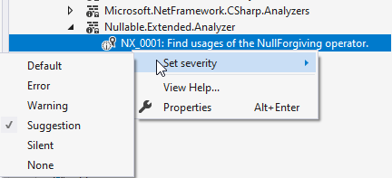

# Nullable Extended Analyzer

## A Roslyn analyzer to improve the experience when working with nullable reference types.

[Nullable reference types](https://docs.microsoft.com/en-us/dotnet/csharp/nullable-references) 
are a great feature introduced with C# 8.0. It really helps in writing better code.

### Suppressing false positives

However when working with it a while you'll may notice some false positive `CS8602` or `CS8604` warnings that may be not expected.
E.g. when working with [ReSharper's](https://www.jetbrains.com/resharper/) static analysis, it will enforce to use some 
patterns that are not covered by the built-ins flow analysis. (see e.g. issues [49653](https://github.com/dotnet/roslyn/issues/49653) 
or [48354](https://github.com/dotnet/roslyn/issues/48354)). While [ReSharper's](https://www.jetbrains.com/resharper/) analyzer based on 
it's own nullability annotations correctly handled those patterns, the C# Roslyn analyzer will raise a `CS8602` warning:

```c#
public void Method(object? a) 
{
    var b = a?.ToString();

    if (b == null)
        return;

    // If b is not null, a can't be null here, but a CS8602 is shown:
    var c = a.ToString();
}
``` 

The **Nullable Extended Analyzer** addresses these issues by double checking `CS8602` and `CS8604` warnings.
It leverages the flow analysis of the [Sonar Analyzer](https://github.com/SonarSource/sonar-dotnet) and suppresses the 
warning if flow analysis reports that access is safe.

- This may not cover all cases, but the most ubiquitous.
- You may need at least MSBuild 16.8 so have suppressions work correctly.

### Managing Null Forgiving Operators

Sometimes it is necessary to use the [null forgiving operator "!"](https://docs.microsoft.com/en-us/dotnet/csharp/language-reference/operators/null-forgiving) to suppress a false warning.
However if you have used too many of them, it renders the value of nullable checks almost useless.
Also since this analyzer will suppress the most common false positives, many of them may be obsolete after installing the analyzer.

Since it's hard to find them in code, this analyzer comes with a check to locate all of them, so you can judge if they are still needed.
Simply turn the severity, which is none by default, to e.g. Warning, to list all usages of the null forgiving operator.

